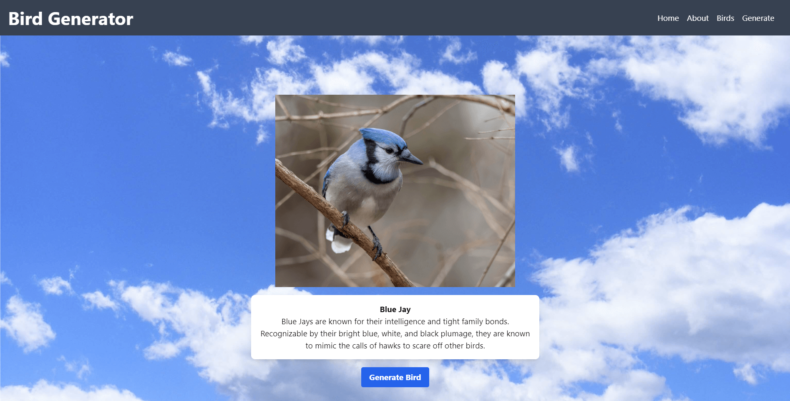

# Bird Generator App

[View it live here](https://birdgenerator.onrender.com)

## About

Bird Generator is a full-stack application developed with the goal of providing an interactive and educational platform for users to explore, learn about, and randomly generate data on various bird species found in America.

## Features

1. **Bird Discovery:** Browse through a comprehensive list of American bird species and delve into detailed information about each one, including its image, name, and description.
2. **Random Bird Generation:** Engage with an interactive feature that generates random bird data for both educational and entertainment purposes.
3. **User-friendly Design:** Navigate seamlessly through the application courtesy of a responsive and interactive UI.

## Tech Stack

- Frontend: React, JavaScript, Tailwind CSS
- Backend: Node.js, Express.js
- Database: PostgreSQL
